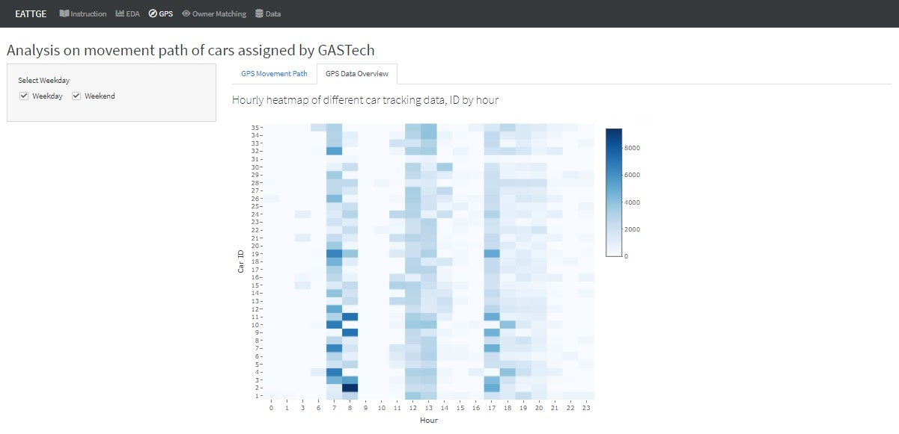
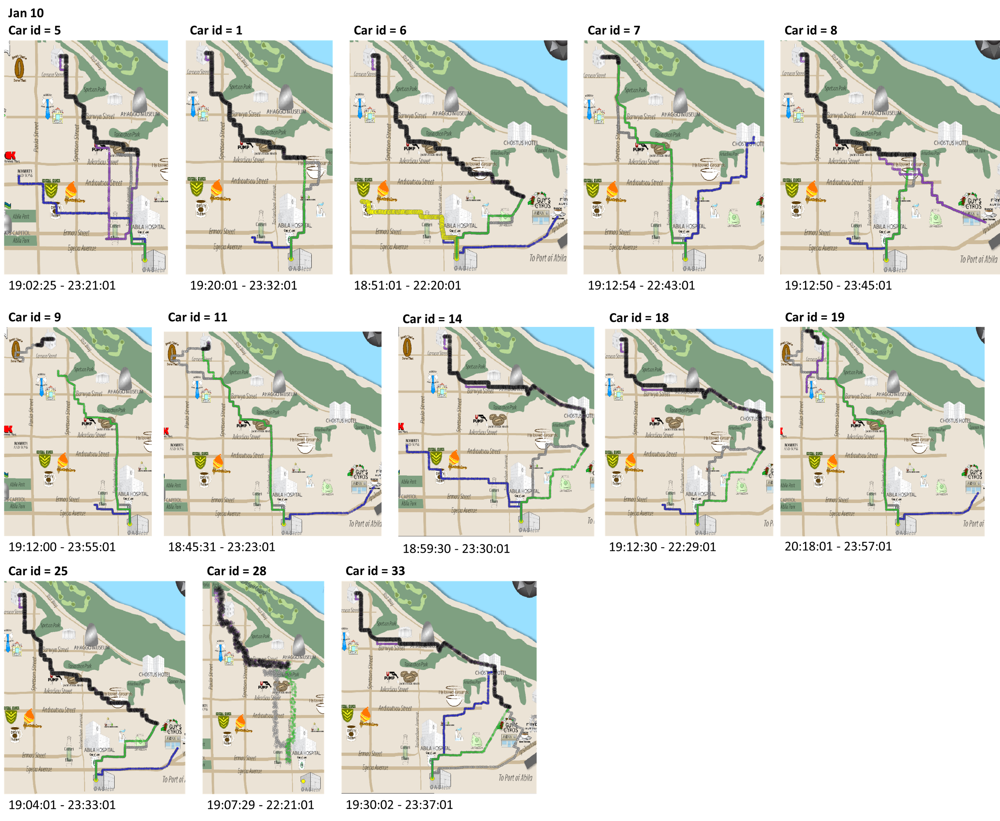

```{r setup, include=FALSE}
knitr::opts_chunk$set(echo = FALSE)
```

# Introduction

The IEEE Visual Analytics Science and Technology (VAST) Challenge is an annual contest of which the goal is to advance the field of visual analytics through the competition. The VAST Challenge is designed to help participators to understand how their analytic tools would be used in a novel analytic task and determine if their data transformations, visualizations and interactions would be beneficial for solving the challenges.

2021 Mini Vast Challenge 2 presented the scenario:  some Kronos-based employees of GAStech oil and gas company went missing. Car tracking data for the two weeks leading up to the disappearance, as well as credit card transactions and loyalty card usage data related to missing employees are provided. This challenge is concentrated on exploring the anomalies, recognizing the ownership of the cars and cards and identifying suspicious patterns of behaviours by analysing the movement and tracking data, as well as the transaction data. 

In this paper, we aim to leverage the richness of the movement and transactions data to provide an interactive visualisation for exploring suspicious behaviours of GAStech Employee and generating insights.

# Motivation

The task of Mini Challenge 2 is to explore anomalies and get meaningful insights based on the given dataset to help the investigation of the incident. As the tracking data provided here are geospatial data with aspatial information, a good way to present the movement information is to show the path on the map. 

To identify the anomalies of transactions for credit cards and loyalty cards, we need to compare the detailed transaction information including the location, date and price. Also, in order to identify the owners of cars and cards, looking at the tacking data for each car is inevitable. Instead of generating tracking for each car, an interactive visualisation application which allows user to select carID and timeslots they would look at is more efficient and helpful.

There are four key aspects in this interactive visualization application. With this application, we hope to provide an interactive experience to explore the disappearance of Kronos-based employees of GAStech by linking transactions and tracking data together.  

# Approaches

* Analysis of Kronos Incident dataset with background research
* Exploratory Data Analysis (EDA) methods in R
* Exploratory Spatial Data Analysis (ESDA) methods in R
* R Markdown development for functionality checks
* R-Shiny app development for user interactivity

# Results

### EDA for transaction data of credit and loyalty cards

The heatmap on the left side is showing consumption frequency grouped by location and date of Jan, while the right side one is by location and hour of the day. On the left side, users can switch the card type (credit or loyalty card). The boxplot below is designed to show transaction price of different locations. Users can select card numbers, switch between weekday and weekend, or even select the exact days to customize the charts and explore on details.

```{r out.width="100%"}
knitr::include_graphics("images/df_t1.1eda.jpg")
```

### Analysis of GPS tracking data

Car GPS movement path shown on the city map of Abila: The left plot represents different dates by colors, while the right one representing different time slot by different colors. Users can explore on each car ID and date by selecting from the dropdown list on the left side. Besides, if hover the cursor over the layer logo on the right side map, users could filter shape layer for the target time slot .

```{r out.width="100%"}
knitr::include_graphics("images/df_t2.1map.jpg")
```

Houly heatmap of different car tracking data: By checking or unchecking "Weekday" and "Weekend" option, users can focus on different hourly moving frequency of each car.

```{r out.width="100%"}

```

### Inference for the owners of cards

Correspondence between car owner and credit card/loyalty card holder: The table summarized the corresponding relationships of GAStech staff, cars and credit/loyalty cards.

```{r out.width="100%"}
knitr::include_graphics("images/df_t3.1om.jpg")
```

# Insight

### Evening grouping on Jan 10

We check the tracking data of all the cars on Jan 10 and found that some of them came to the same places and stayed together for some time. The period they stayed is shown below the figure, most of them started from around 7 pm and ended at around 11 pm.

We can see they are all Information Technology or Engineering employees, but not all employees of these two departments took part in that grouping. The assumption is that those have a good relationship in the two departments had these party in the home of one of them.

```{r out.width="90%",fig.align='center'}

```

### Security gather around Executive's home

According to the GPS path, we observe that some securities visit the same location at the mid-night and wee hours of on different date. The location they go around is the home of Barranco, an executive of GAStech.

```{r out.width="90%",fig.align='center'}
knitr::include_graphics("images/security_1.png")
```

As the movement the security go around Barranco'home is so suspicious, we infer that the Security was monitor the executive's behaviour after work from 6 Jan to 11 Jan.

# Future Work

Some location recorded in transaction data cannot be found in the given picture and then cannot do further analysis. In the future maybe we can explore the previous work and try different ways to process the file and get those locations or find the locations directly.

Also,we find that there exist a credit card that can match with two loyalty cards and a loyalty card that can match with two credit cards. Some potential unofficial relationships would be identified if further exploration could be done. Besides, the inference of owners of each credit card and loyalty card could be more detailed and accurate after we take the tracking data of trucks into consideration.

```{r, echo=FALSE, eval=FALSE}
library(pagedown)
pagedown::chrome_print("Poster.html")
```
