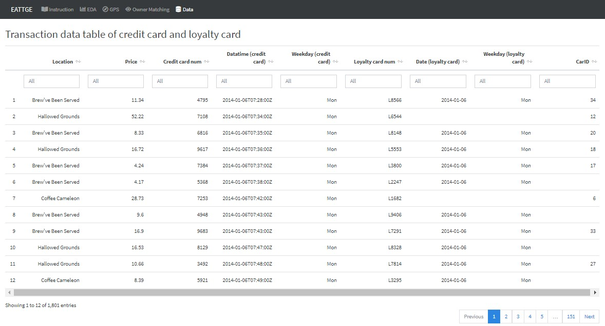
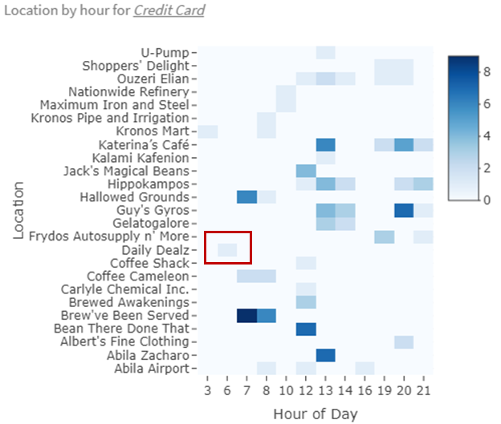
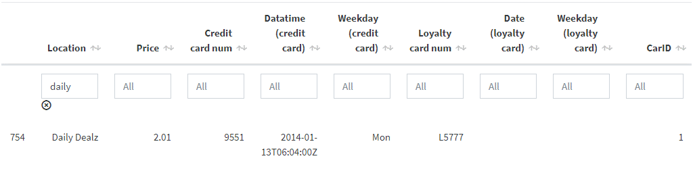

```{r setup, include=FALSE}
library(knitr)  # Added by DF
library(tinytex)
options(tinytex.verbose = TRUE)
knitr::opts_chunk$set(echo = FALSE, fig.pos = "H", fig.align='center')
```


# Introduction 

The IEEE Visual Analytics Science and Technology (VAST) Challenge is an annual contest of which the goal is to advance the field of visual analytics through the competition[@Yskak2020]. The VAST Challenge is designed to help participators to understand how their analytic tools would be used in a novel analytic task and determine if their data transformations, visualizations and interactions would be beneficial for solving the challenges.

2021 Mini Vast Challenge 2 presented the scenario:  some Kronos-based employees of GAStech oil and gas company went missing. Car tracking data for the two weeks leading up to the disappearance, as well as credit card transactions and loyalty card usage data related to missing employees are provided. This challenge is concentrated on exploring the anomalies, recognizing the ownership of the cars and cards and identifying suspicious patterns of behaviours by analysing the movement and tracking data, as well as the transaction data. 

In this paper, we aim to leverage the richness of the movement and transactions data to provide an interactive visualisation for exploring suspicious behaviours of GAStech Employee and generating insights.

# Motivation of The Application

The task of Mini Challenge 2 is to explore anomalies and get meaningful insights based on the given dataset to help the investigation of the incident. As the tracking data provided here are geospatial data with aspatial information, a good way to present the movement information is to show the path on the map. 

To identify the anomalies of transactions for credit cards and loyalty cards, we need to compare the detailed transaction information including the location, date and price. Also, in order to identify the owners of cars and cards, looking at the tacking data for each car is inevitable. Instead of generating tracking for each car, an interactive visualisation application which allows user to select carID and timeslots they would look at is more efficient and helpful.

With this application, we hope to provide an interactive experience to explore the disappearance of Kronos-based employees of GAStech by linking transactions and tracking data together.  

There are four key aspects in this interactive visualization application,

1.	Transactions exploration 
2.	Gps Map
3.	Ownership of car and cards
4.  Transaction data table of credit and loyalty card

# Review of Previous Work

We read some products of VAST Challenge 2014 since that challenge has the same theme as VAST Challenge 2021. The works are listed in the Visual Analytics Benchmark Repository. In addition, we also referred to some research papers.

The product of Peking University[@Chen2014] received the award of Excellent Comprehensive Visual Analysis System. Here are what we learned from them.

Heatmap is useful for analyzing the population of the locations. The shade of the color can represent the frequency of transactions that happened in a specific location. For example, the darker the color, the more the transactions, the more popular the location is.

Weekdays and weekends may have different patterns. People need to work and go to the company on weekdays, while they usually arrange the shopping or other entertainment on weekends. If we do not consider this, some of the anomalies cannot be found.

Instead of analyzing the coordinate number, it is more straightforward to display the car tracking data on the map. Also, we need to notice that different periods (weekdays or weekends) have different traffic patterns.

In the GPS data analysis part, not only is the day type very important, but also the different periods of the day. For example, the employee goes to the company on weekdays is very common, but the employee go to the company at midnight or early morning is not that normal. We can segment the car tracking data by the different periods in a day to see the details.

In addition, the data table is a good way to show and explain the result.

Finally, QGIS is an appropriate software to  operate the jpg image so that it is combined with the geospatial data. Then it is possible to plot the car tracking data to the map.

The product of Middlesex University[@Attfield2014] was awarded as Honorable Mention: Effective Use of a Custom Tool. There is one detailed map, where includes some locations that do not appear in the given tourist jpg images. We can refer to this one when needed.

It is also a good choice to using a bar plot to visualize the amount or count. But it is not good to use 3D format, it will make the figure difficult to recognize the amount. Also, it is not wise to show the x-axis label vertical since readers cannot read them conveniently.

In summary, it is necessary to check the car tracking details for every car at a different time to get more useful insight. We need to take care of the abnormal activity time, especially large transaction numbers, abnormal overtime work, the arrivals to the same not normal place of different car owners.

# Design of Framework

The Design of our Shiny App is to provide a visualization tool of the GPS track and credit/loyalty card transaction data, so that the users could not only get an overview of data distribution, but also do exploration and analysis to derive deeper insights. Further more, the Shiny APP is designed to be highly interactive but easy to operate, since applied visualization techniques should focus on user-specific needs and be easily understandable to users (Haara et al., 2018) [@HAARA201871].

Users could hover over the plot to see the tooltip with more detailed information, click on the figure to drill down the data, drag and drop to zoom in part of graphs. Several selections are set at the left side of charts to help users quickly customize the filter criteria by themselves. Besides, our Shiny App accomplished the interactivity between data table and charts which makes it convenient to detect relationships within data sets.

To start with, the introduction page give an overview of the background and structure of the application. This allows users to have an understanding of the case to be explored. Then come four visualization panels namely: EDA, GPS, Owner Matching and Data.

## Exploratory data analysis

The first tab panel aims to enable users to do Exploratory Data Analysis (EDA) on transaction data of credit/loyalty card, observe the popular spots and detect abnormal activities. 

As shown in the following figure, this panel is consist of a side bar with several selections on the left, and three charts on the right, including two heatmaps and one boxplot. The heatmap on the left side is showing consumption frequency grouped by location and date of Jan, while the right side one is by location and hour of the day. On the left side, users can switch the card type to see the heatmap for credit card or loyalty card. The boxplot below is designed to show transaction price of different locations. Users can select card numbers, switch between weekday and weekend, or even select the exact days to customize the charts and explore on details.

```{r fig.cap='EDA for transaction data of credit and loyalty cards', out.width="100%"}
include_graphics("images/df_t1.1eda.jpg")
```

## GPS trajectory analysis

The second tab panel is designed to visualize the GPS track data of selected car(s). There are two sub panels named as "GPS Movement Path" and "GPS Data Overview" respectively. The first sub panel is shown as the following figure, displaying the two week trajectories of the specific car. The left plot represents different dates by colors, while the right one representing different time slot of a day by different colors. Users can explore on each car ID and date by selecting from the dropdown list on the left side. Besides, if hover the cursor over the layer logo on the right side map, users could filter shape layer for the target time slot to see the movement path of a specific time period clearly.

```{r fig.cap='Car GPS movement path shown on the city map of Abila', out.width="100%"}
include_graphics("images/df_t2.1map.jpg")
```

Another sub panel consist a heatmap revealing the frequency of car tracking data grouped by car ID and hour of days. By checking or unchecking "Weekday" and "Weekend" option, users can focus on weekday or weekend hourly moving frequency of each car.

```{r fig.cap='Houly heatmap of different car tracking data', out.width="100%"}
include_graphics("images/df_t2.2hm.jpg")
```

## Owner matching analysis

The third tab panel is very important as it shows the correspondence between owners of cars and credit/loyalty cards. The panel mainly includes three parts, one table on the left and two charts on the right. 

The table summarized the corresponding relationships of GAStech staff, individual cars and credit/loyalty cards. 

Further more, users can make use of the interactivity between the data table and two charts to drill down and visualize the data for each specific staff. By clicking on the data table row, two charts would automatically show up on the right side. Therein the boxplot is displaying the GPS tracking frequency of selected car(s) by hour and date. Users can see the exact record counts by hover cursor over the box. The line chart shows the transaction record of selected card holder(s) in each day and every location. Users can switch between credit card and loyalty card by click the button above. This make it easy to do comparison of GPS track data and transaction data within or between employees of GAStech.  

```{r fig.cap='Correspondence between car owner and credit card/loyalty card holder', out.width="100%"}
include_graphics("images/df_t3.1om.jpg")
```

## Data tabel

The last tab panel is actually a data table for details of individual transaction record. Credit card and loyalty card transactions are joined together by matching the common card number, location, price and date.

```{r fig.cap='Merged transaction data table of credit card and loyalty card', out.width="100%"}

```

The combination of above visualization panels would give users a completed view of data, as well as much freedom to explore and focus on the details of each point. By using these charts and integrating the findings, users could derive more meaningful insights on the abnormal trajectories and transactions with less efforts.

# Use Case

## Exploration of transaction data 

By checking the heatmap of credit and loyalty transaction frequency, we can see that the employees do have some preference on the locations (figure 6).

```{r fig.cap='Heatmap of Transaction Frequency of credit card (left) and loyalty card (right)', out.width="100%"}
include_graphics("images/heatmap_cc_loy.png")
```

The most popular location is Katerina’s Café, then comes to Hippokampos, Guy’s Gyros and Brew’ve Been Served. The former 3 opens 7 days a week while the last one closed at weekends.

Katerina’s Cafe, was very popular on weekdays, seems to have relatively fewer transactions on Fridays and Sundays, and is still popular on Saturdays.

By referring to the tourist map we can see that most of those places are near the company GAS tech and is suitable for meals. The locations of Hippokampos are identified according to the previous work by Middlesex University, it is relatively far from the company. And the Ouzeri Elian and Hallowed Grounds are also quite popular and quite close to the company.

```{r fig.cap='Location by Hour Heatmap of Transaction Frequency of credir cards on weekdays (left) and weekends (right)', out.width="100%"}

```

Katerina’s Café did not have transactions record before 12 pm and is busy at 13 pm and 20 pm on weekdays, 7-8 pm on weekends. Hippokampos and Guy’s Gyros are the same as Katerina’s Cafe (figure 7). Brew’ve Been Served is popular in the morning, around 7-8 am on weekdays. Besides, Hallowed Grounds is also a popular place for breakfast on weekdays as Brew’ve Been Served.

```{r fig.cap='Box Plot of Transaction Price by Location on  weekdays (up) and weekends (down)', out.width="100%"}
include_graphics("images/boxplot.png")
```

From the boxplot, we can see that people did not go to some places on weekends, and there is one extra-large transaction that happened at Frydos Autosupply n’ More using a credit card, but no such recording on the loyalty card.

## Analysis of GPS tracking data

From the GPS overview heatmap, we can check the number of recordings of different cars in different hours. If we focus on the recordings that happened after 10 pm on weekdays, we can check those cars in the GPS movement path.

```{r fig.cap='Hourly heatmap of different car tracking data on weekdays', out.width="100%"}

```

In the GPS path movement, the color of the dots represents the different periods (details in the following table).

```{r fig.cap='Mapping of colors in each time slot of the day', out.width="100%"}

```

First, we select all weekdays and check car 1, we can see there are some black dots, which means the car movement recordings happened after 10 pm. We can refer to the left figure to check the day number and then only select the specific day to see more details.

We can find that there are several employees get together on the evening of Jan 10. The details can be found on 6.2.2 evening grouping on Jan10.

```{r fig.cap='Steps of the GPS data exploration', out.width="100%"}
include_graphics("images/gpsanalysis.png")
```

## Inference for the owners of cards

### Matching credit card and loyalty card

As the transaction records on loyalty card are generated from the transactions on credit card, the detailed information for each transaction recorded on loyalty card should have same location, purchase time and price as records on credit card.

Therefore, we merge transactions on credit card with transactions on loyalty card together based on the transactions with same location, transaction date and price to identify the credit card and its corresponding loyalty card. A new transaction records would be generated including both credit card number and loyalty card number for each transaction as shown below.

```{r fig.cap='Credit card and Loyalty card Matching', out.width="100%"}

```

### Infering the owner of vehicle and Credit card

The main basis of our inference for the owners of credit card and loyalty card is that the owner visited the location around the time when the transactions produced in terms of the movement events of their vehicles. To infer the ownership of cards, firstly, we need to find out the accurate time transactions produced on each location based on the transaction records. The timestamps would be used for select out the vehicle which went to the location in the specific timeslots using the interactive GPS visualisation application. According to the combination of the exploration of transactions and tracking events, we can link the car id with credit card number and loyalty card number together easily. After taking the owner of car into consideration, A clear relationship among car id, credit card, loyalty card and owner's information would be presented.

```{r fig.cap='Inference for the owners of cards', out.width="100%"}

```

To better present the way we use to infer the owners of each credit card and loyalty card, we provide a example here to elaborate more. For the location Albert's Fine Clothing, there are two transaction produced on 6 Jan around 9 pm and  we can easily find out the cars with id 1 and 24 visit there at that moments by tracking movement event for each car using interactive GPS application. In order to differentiate these two cars, we track the movement event for each car on both 6 Jan and 9 Jan together as the credit card with last four number 4434 also has a purchase record on 9 Jan while the credit card with last four number 9551 just purchase on 6 Jan.

```{r fig.cap="Transactions for Albert's Fine Clothing", out.width="100%"}

```

```{r fig.cap="Tracking Movement for Cars going to Albert's Fine Clothing on 6 Jan around Transactions' Timestamp", out.width="100%"}

```

Similarly, there is only one transactions produced on 7 Jan and 8 Jan. The car with id 11 and  the car with id 3 visit this location around the purchased time on 7 Jan and 8 Jan, respectively in terms of the Transactions and GPS visualisation application.

```{r fig.cap="Tracking Movement for Cars going to Albert's Fine Clothing on 7 Jan and 8 Jan around Transactions' Timestamp", out.width="100%"}

```

Combining the analysis above and the car assignment information, we can get the relationships shown below.

```{r fig.cap='The matching result for owners of cards and cars', out.width="100%"}
include_graphics("images/matching_result.png")
```

# Discussion And Insight

## Informal relationship identification

According to the card transactions, we can find that there are totally nine transactions produced at Chostus Hotel in the past two weeks. What's more, the transactions are always produced from the credit card with last four number 2540 and the credit card with last four number 9683 except the transaction produced on 18 Jan.
The transactions are often produced around 13pm on weekdays and What can't be ignored is that the timestamp of transaction from the two cards is so close to each other that we are confident that the owners of the two cards went there together for lunch. The owners of cards are Elsa and Brand based on the ownership of cards we found in previous section. 

Therefore, we infer that Elsa and Brand are not only colleagues, but also in a relationship or couples.

```{r fig.cap='Transations for Chostus Hotel', out.width="100%"}

```

```{r fig.cap='Owenrships of Credit Cards with last for number 2540 and 9683', out.width="100%"}

```

## Activities

### Robert and sons

If we go through the tracking events for each car, it can be easily found that a couple of employees drove to Roberts and Sons on 13 January around 13pm. For Example, the path line of the car with id 3,4,11,13,15,19,20 and 22 are observed around Roberts and Sons. However, there are no transactions produced at that moment even on that day. As we learn more information for the employees who visited the location at that moment from the table of ownership of cars and cards, we realize that one of them is SVP/CFO of GAStech and rest of them are either engineers or security staff. 

Hence, we infer that this was a team building activity and they had lunch together. Also, the SVP/CFO paid the bill with business payment channel instead of using the personal credit card, which explains the reason why there is no transaction records on their personal credit cards.

```{r fig.cap='Tracking of cars went to Roberts and Sons on 13 January around 13pm', out.width="100%"}

```

```{r fig.cap='Transactions for Roberts and Sons', out.width="100%"}
include_graphics("images/Roberts_1.png")
```

### Evening grouping on Jan 10

```{r fig.cap='Evening grouping on Jan 10', out.width="100%"}
include_graphics("images/jan10grouping.png")
```

We check the tracking data of all the cars on Jan 10 and found that some of them came to the same places and stayed together for some time. The period they stayed is shown below the figure, most of them started from around 7 pm and ended at around 11 pm.

```{r fig.cap='Employee detail of those group together on Jan 10 evening', out.width="100%"}

```

We can see they are all Information Technology or Engineering employees, but not all employees of these two departments took part in that grouping. The assumption is that those have a good relationship in the two departments had these party in the home of one of them.

### Security gather around Executive's home

```{r fig.cap="Location of Executive's home", out.width="100%"}

```

According to the GPS path, we observe that some employees visit the same location at the mid-night and wee hours of on different date. The ids of these cars are 15, 16, 21 and 24. The location they go around is the home of the owner of car with id 4. Taking the owners of car into consideration, we can know that employees from Security department appear around the location of the house of Barranco, an executive of GAStech at the late night and wee hours from 6 Jan to 11 Jan. 

```{r fig.cap="Security gather around Executive's home", out.width="100%"}

```

As the movement the security go around Barranco'home is so suspicious, we infer that the Security was monitor the executive's behaviour after work from 6 Jan to 11 Jan.

### Weekends grouping at Katherina’s Cafe

Katherina’s Café is so close to GAStech that it is popular among GAStech staff. They always go there for lunch and most of transactions produced around 13pm on every weekday explains that. However, we find that there still some transactions produced from 7 pm to 8 pm on last two Saturdays, then we infer that the employees had weekends grouping for parties there.

```{r fig.cap='Transactions at Katherina’s Cafe on Saturday', out.width="100%"}

```

## Another abnormal place: Kronos Mart

From the heatmap, we can see that there are several transactions (5 actually) that happened at 3 am in Kronos Mart, which is quite abnormal cause the mart generally doesn’t open at that time. They are from different credit cards, 1 of them happened on Monday, 4 of them happened on Sunday. Those happened on Sunday, 3 of them happened on Jan 19.

```{r fig.cap='Heatmap of transactions frequency on specific days', out.width="100%"}
include_graphics("images/kronosmarthm.png")
```

However, the transaction amount of the five records did not show any difference and all ten transactions that happened in Kronos Mart are made from different 10 cards.

In addition, the logic of our credit card and loyalty card matching is introduced before in the use case. After we get the matching result, we will generate the result for all transactions. We can see that on Kronos Mart, the transaction price is matched but the transaction time is always credit card one day later than loyalty card. So the transactions will appear on the table twice. Maybe there are some delays in the transactions that happened on Kronos Mart using credit cards.

```{r fig.cap='Transaction data table of credit card and loyalty card on Kronos Mart', out.width="100%"}

```

# Future Work

## Further explore the geospatial data

For Daily Dealz, there is only one transaction that happened at 6 am on Monday, Jan 13. And if we check the last 4 cc numbers, we can see that the owner of this card had a transaction that happened at 3 am in Kronos Mart on Sunday, Jan 19. Also, the amount is specially small (2.01).

```{r fig.cap='Transaction happened in Daily Dealz', out.width="100%"}

```

```{r fig.cap='Transaction happened in Daily Dealz', out.width="100%"}

```

We cannot find the place in the given picture and then cannot do further analysis. In the future maybe we can explore the previous work and try different ways to process the file and get those locations or find the locations directly.

## Owner inferrence

when identify the owners of each credit card and loyalty card, we find that there exist a credit card that can match with two loyalty cards and a loyalty card that can match with two credit cards. For the multiple matching case, some potential unofficial relationships would be identified if further exploration could be done. Besides, the inference of owners of each credit card and loyalty card could be more detailed and accurate if the tracking of trucks could be taken into consideration.

# References

---
references:
- id: Yskak2020
  title: Solving disappearance at GASTech with visual analytic techniques
  author:
  - family: Yskak
    given: Saulet
  type: misc
  note: 'https://openscholarship.wustl.edu/cse_research/1183?utm_source=openscholarship.wustl.edu%2Fcse_research%2F1183&utm_medium=PDF&utm_campaign=PDFCoverPages'
  issued:
    year: 2020
    month: 5
- id: Chen2014
  title: VAST Challenge 2014, Mini-Challenge 2
  author:
  - family: Chen
    given: Siming
  type: misc
  note: 'http://visualdata.wustl.edu/varepository/VAST%20Challenge%202014/challenges/MC2%20-%20Patterns%20of%20Life%20Analysis/'
  issued:
    year: 2014
- id: Attfield2014
  title: VAST Challenge 2014, Mini-Challenge 2
  author:
  - family: Attfield
    given: Simon
  type: misc
  note: 'http://visualdata.wustl.edu/varepository/VAST%20Challenge%202014/challenges/MC2%20-%20Patterns%20of%20Life%20Analysis/entries/Middlesex%20University/'
  issued:
    year: 2014

...

