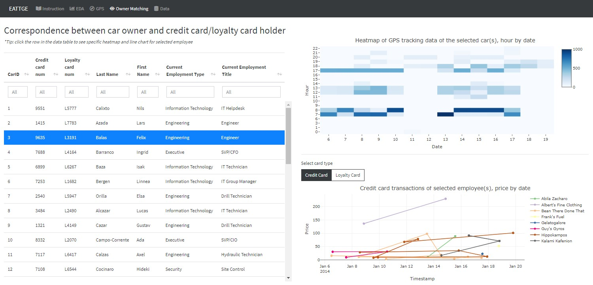

```{r setup, include=FALSE}
library(knitr)  # Added by DF
library(tinytex)
options(tinytex.verbose = TRUE)
knitr::opts_chunk$set(echo = FALSE, fig.pos = "H", fig.align='center')
```


# Introduction 

The IEEE Visual Analytics Science and Technology (VAST) Challenge is an annual contest of which the goal is to advance the field of visual analytics through the competition[@Yskak2020]. The VAST Challenge is designed to help participators to understand how their analytic tools would be used in a novel analytic task and determine if their data transformations, visualizations and interactions would be beneficial for solving the challenges.

2021 Mini Vast Challenge 2 presented the scenario:  some Kronos-based employees of GAStech oil and gas company went missing. Car tracking data for the two weeks leading up to the disappearance, as well as credit card transactions and loyalty card usage data related to missing employees are provided. This challenge is concentrated on exploring the anomalies, recognizing the ownership of the cars and cards and identifying suspicious patterns of behaviours by analysing the movement and tracking data, as well as the transaction data. 

In this paper, we aim to leverage the richness of the movement and transactions data to provide an interactive visualisation for exploring suspicious behaviours of GAStech Employee and generating insights.

# Motivation of The Application

The task of Mini Challenge 2 is to explore anomalies and get meaningful insights based on the given dataset to help the investigation of the incident. As the tracking data provided here are geospatial data with aspatial information, a good way to present the movement information is to show the path on the map. 

To identify the anomalies of transactions for credit cards and loyalty cards, we need to compare the detailed transaction information including the location, date and price. Also, in order to identify the owners of cars and cards, looking at the tacking data for each car is inevitable. Instead of generating tracking for each car, an interactive visualisation application which allows user to select carID and timeslots they would look at is more efficient and helpful.

With this application, we hope to provide an interactive experience to explore the disappearance of Kronos-based employees of GAStech by linking transactions and tracking data together.  

There are three key aspects in this interactive visualisation application,

1.	Transactions exploration 
2.	Gps Map
3.	Ownership of car and cards

# Review of Previous Work

We read some products of VAST Challenge 2014 since that challenge has the same theme as VAST Challenge 2021. The works are listed in the Visual Analytics Benchmark Repository. In addition, we also referred to some research papers.

The product of Peking University[@Chen2014] received the award of Excellent Comprehensive Visual Analysis System. Here are what we learned from them.

Heatmap is useful for analyzing the population of the locations. The shade of the color can represent the frequency of transactions that happened in a specific location. For example, the darker the color, the more the transactions, the more popular the location is.

Weekdays and weekends may have different patterns. People need to work and go to the company on weekdays, while they usually arrange the shopping or other entertainment on weekends. If we do not consider this, some of the anomalies cannot be found.

Instead of analyzing the coordinate number, it is more straightforward to display the car tracking data on the map. Also, we need to notice that different periods (weekdays or weekends) have different traffic patterns.

In the GPS data analysis part, not only is the day type very important, but also the different periods of the day. For example, the employee goes to the company on weekdays is very common, but the employee go to the company at midnight or early morning is not that normal. We can segment the car tracking data by the different periods in a day to see the details.

In addition, the data table is a good way to show and explain the result.

Finally, QGIS is an appropriate software to  operate the jpg image so that it is combined with the geospatial data. Then it is possible to plot the car tracking data to the map.

The product of Middlesex University[@Attfield2014] was awarded as Honorable Mention: Effective Use of a Custom Tool. There is one detailed map, where includes some locations that do not appear in the given tourist jpg images. We can refer to this one when needed.

It is also a good choice to using a bar plot to visualize the amount or count. But it is not good to use 3D format, it will make the figure difficult to recognize the amount. Also, it is not wise to show the x-axis label vertical since readers cannot read them conveniently.

In summary, it is necessary to check the car tracking details for every car at a different time to get more useful insight. We need to take care of the abnormal activity time, especially large transaction numbers, abnormal overtime work, the arrivals to the same not normal place of different car owners.

# Design of Framework

The Design of our Shiny App is to provide a visualization tool of the GPS track and transaction data, so that the users not only could get an overview of data distribution, but also do exploration and analysis to derive deeper insights on data. Further more, the Shiny APP is designed to be highly interactive but easy to operate, since applied visualization techniques should focus on user-specific needs and be easily understandable to users (Haara et al., 2018) [@HAARA201871].

Users could hover over the plot to see the tooltip with more detailed information, click on the figure to drill down the data, drag and drop to zoom in part of graphs. Several selections are set at the left side of charts to help users quickly customize the filter criteria by themselves. Besides, our Shiny App accomplished the interactivity between data table and charts which makes it convenient to detect relationships within data sets.

To start with, the introduction page give an overview of the background and structure of the application. This allows users to have an understanding of the case to be explored. Then come four visualization panels namely: EDA, GPS, Owner Matching and Data.

## Exploratory data analysis

The first tab panel aims to enable users to do Exploratory Data Analysis (EDA) on transaction data of credit and loyalty card, to observe the popular spots and detect abnormal activities. 

As shown in the following figure, this panel is consist of a side bar with several selections on the left, and three charts on the right, including two heatmaps and one boxplot. The heatmap on the left side is showing consumption frequency grouped by location and date of Jan, while the right side one is by location and hour of the day. On the left side, users can switch the card type to see the heatmap for credit card or loyalty card. The boxplot below is designed to show transaction price of different locations. Users can select card numbers, switch between weekday and weekend, or even select the exact days to customize the charts and explore on details.

```{r fig.cap='EDA for transaction data of credit and loyalty cards', out.width="100%"}
include_graphics("images/df_t1.1eda.jpg")
```

## GPS trajectory analysis

The second tab panel is designed to visualize the car GPS tracking data. There are two sub panels named as "GPS Movement Path" and "GPS Data Overview" respectively. The first sub panel is shown as the following figure, displaying the two week trajectories of the specific car. The left plot represents different dates by colors, while the right one representing different time slot of a day by different colors. Users can explore on each car ID and date by selecting from the dropdown list on the left side. Besides, if hover the cursor over the layer logo on the right side map, users could filter shape layer for the target time slot to see the movement path of a specific time period clearly.

```{r fig.cap='Car GPS movement path shown on the city map of Abila', out.width="100%"}
include_graphics("images/df_t2.1map.jpg")
```

Another sub panel consist a heatmap revealing the frequency of car tracking data grouped by car ID and hour of days. By checking or unchecking "Weekday" and "Weekend" option, users can focus on weekday or weekend hourly moving frequency of each car.

```{r fig.cap='Houly heatmap of different car tracking data', out.width="100%"}
include_graphics("images/df_t2.2hm.jpg")
```

## Owner matching analysis

The third tab panel is very important as it shows the correspondence between owners of cars and credit/loyalty cards. The panel mainly includes three parts, one table on the left and two charts on the right. The table summarized the corresponding relationships of GASTech staff, individual cars and credit/loyalty cards. On the right side, the boxplot is displaying the GPS tracking frequency of cars by hour and date. Users can see the exact record counts bu hover cursor over the box. The line chart shows the transaction record in each day and every location. Users can switch between credit card and loyalty card by click the button above.

Further more, users can make use of the interactivity between the data table and two charts to drill down and visualize the data for each specific staff. By clicking on the data table row, the two charts would automatically show the data of the selected car owner/card holder. This make it easy to do comparison of GPS track data and transaction data within or between employees of GASTech.  

```{r fig.cap='Correspondence between car owner and credit card/loyalty card holder', out.width="100%"}

```

## Data tabel

The last tab panel is actually a data table for details of individual transaction record. Credit card and loyalty card transactions are joined together by matching the common consuming  place and date.

```{r fig.cap='Merged transaction data table of credit card and loyalty card', out.width="100%"}
include_graphics("images/df_t4.1dt.jpg")
```

The combination of above visualization panels would give users a completed view of data, as well as much freedom to explore and focus on the details of each point. By using these charts and integrating the findings, users could derive more meaningful insights on the abnormal trajectories and transactions with less efforts.

# Use Case


## Exploration of transaction data 

By checking the heatmap of credit and loyalty transaction frequency, we can see that the employees do have some preference on the locations (figure ?).


The most popular location is Katerina’s Café, then comes to Hippokampos, Guy’s Gyros and Brew’ve Been Served. The former 3 opens 7 days a week while the last one closed at weekends.

Katerina’s Cafe, was very popular on weekdays, seems to have relatively fewer transactions on Fridays and Sundays, and is still popular on Saturdays.

By referring to the tourist map we can see that most of those places are near the company GAS tech and is suitable for meals. The locations of Hippokampos are identified according to the previous work by Middlesex University, it is relatively far from the company. And the Ouzeri Elian and Hallowed Grounds are also quite popular and quite close to the company.


Katerina’s Café did not have transactions record before 12 pm and is busy at 13 pm and 20 pm on weekdays, 7-8 pm on weekends. Hippokampos and Guy’s Gyros are the same as Katerina’s Cafe.

Brew’ve Been Served is popular in the morning, around 7-8 am on weekdays. Besides, Hallowed Grounds is also a popular place for breakfast on weekdays as Brew’ve Been Served.

In addition, there are several transactions (5 actually) that happened at 3 am in Kronos Mart. They are from different credit cards, but 1 of them happened on Monday, 4 of them happened on Sunday. Those happened on Sunday, 3 of them happened on Jan 19.

However, the transaction amount of the five records did not show any difference and all ten transactions that happened in Kronos Mart are made from different 10 cards.


From the boxplot, we can see that people did not go to some places on weekends, and there is one extra-large transaction that happened at Frydos Autosupply n’ More using a credit card, but no such recording on the loyalty card.

## Analysis of GPS tracking data


## Match ownership


## Informal relationship identification


# Discussion And Insight 


# Future Work


# References

---
references:
- id: Yskak2020
  title: Solving disappearance at GASTech with visual analytic techniques
  author:
  - family: Yskak
    given: Saulet
  type: misc
  note: 'https://openscholarship.wustl.edu/cse_research/1183?utm_source=openscholarship.wustl.edu%2Fcse_research%2F1183&utm_medium=PDF&utm_campaign=PDFCoverPages'
  issued:
    year: 2020
    month: 5
- id: Chen2014
  title: VAST Challenge 2014, Mini-Challenge 2
  author:
  - family: Chen
    given: Siming
  type: misc
  note: 'http://visualdata.wustl.edu/varepository/VAST%20Challenge%202014/challenges/MC2%20-%20Patterns%20of%20Life%20Analysis/'
  issued:
    year: 2014
- id: Attfield2014
  title: VAST Challenge 2014, Mini-Challenge 2
  author:
  - family: Attfield
    given: Simon
  type: misc
  note: 'http://visualdata.wustl.edu/varepository/VAST%20Challenge%202014/challenges/MC2%20-%20Patterns%20of%20Life%20Analysis/entries/Middlesex%20University/'
  issued:
    year: 2014

...

