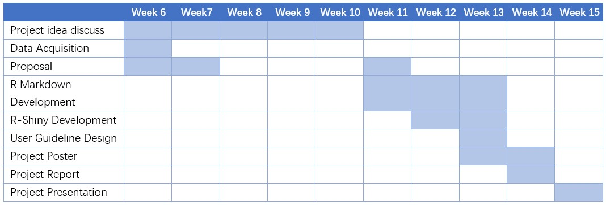
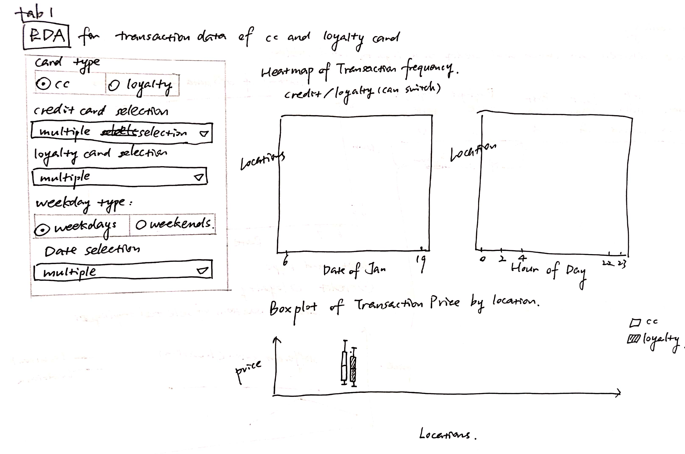
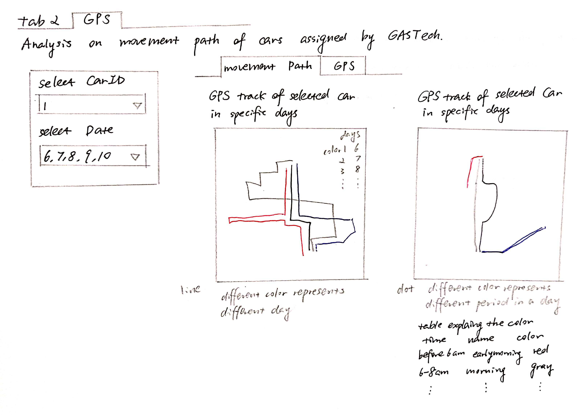
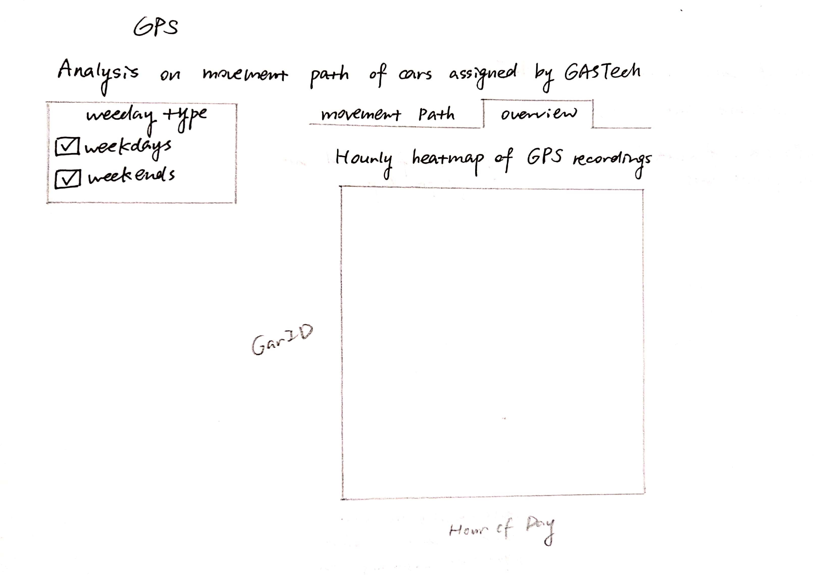
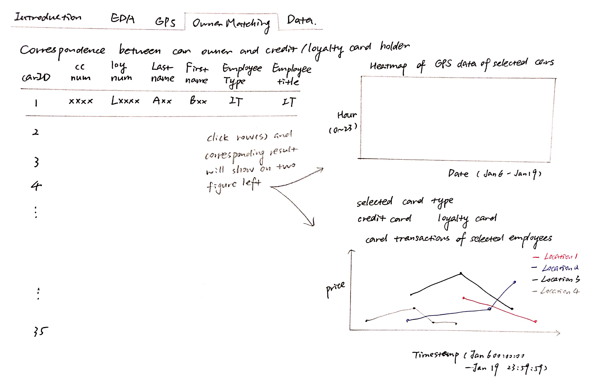

```{r setup, include=FALSE}
knitr::opts_chunk$set(echo = FALSE)
```

# 1. Background 

The IEEE Visual Analytics Science and Technology (VAST) Challenge is an annual contest with the goal of advancing the field of visual analytics through competition. The VAST Challenge is designed to help researchers understand how their software would be used in a novel analytic task and determine if their data transformations, visualizations, and interactions would be beneficial for particular analytic tasks. VAST Challenge 2021 is the so-called Kronos Incident in which several employees of a company named GAStech, located at the island of Kronos went missing. Mini-Challenge 2 aims to find unusual and suspicious behaviors of employees then to make contributions on investigation of the incident.


# 2. Motivation 

The task of Mini Challenge 2 is to explore anomalies and get meaningful insights to make recommendations for further investigation of the incident. The dataset used here combines geospatial data with aspatial information that allows us to apply geospatial regression techniques and geospatial clustering to understand nutrition and obesity at different geographic granularity. 

The missing, conflicting, and imperfect data gives us chances to use exploratory data analysis techniques to discover patterns, spot anomalies, and check assumptions. We will attempt to link the geographic movement data and consumption data of employees' credit card purchases and preferences together to provide actionable insights to the analysis. 


# 3. Project objectives 

This project aims to deliver an R-Shiny application that provides: 

* Interactive user interface design 

* Nutritional information interfaced with a visual chart representation 

* Clustering techniques through both aspatial and geospatial methods 

* Meaningful and valid insights based on the dataset used 


# 4. Proposed Scope and Methodology 

* Analysis of Kronos Incident dataset with background research 

* Exploratory Data Analysis (EDA) methods in R 

* Exploratory Spatial Data Analysis (ESDA) methods in R 

* Clustering methods for aspatial and geospatial information in R 

* R Markdown development for functionality checks 

* R-Shiny app development for user interactivity 


# 5. Project Timeline 


_Fig. 1 The project timeline planned_

# 6. Storyboard & Visualization Features

We plan to design 5 tabs in the R shiny project.

**tab1: Introduction**

We will include the introduction of the R Shiny project in this tab, briefly describe the content of the following 4 tabs.

**tab2: EDA**

This tab includes the heatmap and boxplot for transaction data for credit card and loyalty card.



**tab3: GPS**

This tab includes the two gps tmap and one overview heatmap.





**tab4: Owner Matching**

This tab shows the owner matching result, the corresponding heatmap and line chart will appear when you click the row(S).



**tab5: Data**

This tab presents the matched transaction data, one record will includes at least the car id, credit card number, time stamp (credit card), price (credit card), loyalty card number, time stamp (loyalty card), price (loyalty card).

# 7. Software Tools

**Git hub:** https://github.com/VisualG2G3/VisualG2Group3

**RStudio:** https://rstudio.com/


# 8. Proposed R Packages

* ClustGeo:  https://cran.r-project.org/web/packages/ClustGeo 

* RColorBrewer: https://cran.r-project.org/web/packages/RColorBrewer 

* shiny: https://shiny.rstudio.com 

* shinythemes: https://cran.r-project.org/web/packages/shinythemes 

* shinyWidgets: https://cran.r-project.org/web/packages/shinyWidgets 

* tidyverse:  https://www.tidyverse.org 

* tmap: https://cran.r-project.org/web/packages/tmap 

* sp: https://cran.r-project.org/web/packages/sp 

* leaflet: https://cran.r-project.org/web/packages/leaflet 

* plotly: https://cran.r-project.org/web/packages/plotly 


