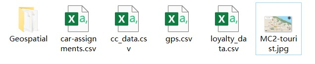

```{r setup, include=FALSE}
knitr::opts_chunk$set(fig.retina = 3,   # To make the figure looks sharper, set the retina value >=3, default is 1 
                      echo = TRUE,      # Show code chunk
                      eval = TRUE,      # Run the code
                      message = FALSE,  # Don't show error massage
                      warning = FALSE)  # Don't show warning massage
```

# 1. Background

## 1.1 Case overview

GAStech is a Tethys-based company having been operating a natural gas production site in the island country of Kronos for over 20 years. It has produced remarkable profits and developed strong relationships with the government of Kronos, but has not been as successful in demonstrating environmental stewardship.

In January, 2014, the leaders of GAStech are celebrating their new-found fortune as a result of the initial public offering of their very successful company. In the midst of this celebration, several employees of GAStech go missing. An organization known as the Protectors of Kronos (POK) is suspected in the disappearance, but things may not be what they seem.

This case is designed aim at helping the law enforcement from Kronos and Tethys investigate the incident by using data visualization techniques. There are 3 challenges in [**VAST Challenge 2021**](https://vast-challenge.github.io/2021/index.html) focusing on different aspects of case analysis. In this report we concentrated on visualization and analysis for Mini-Challenge 2.

## 1.2 Requirement for Mini-Challenge 2

Many of the Abila, Kronos-based employees of GAStech have company cars which are approved for both personal and business use. Those who do not have company cars have the ability to check out company trucks for business use, but these trucks cannot be used for personal business. The vehicles are installed with GPS tracked periodically as long as they are moving. Besides, in order to promote local businesses, Kronos based companies provide a Kronos Kares benefit card to GASTech employees giving them discounts and rewards in exchange for collecting information about their credit card purchases and preferences as recorded on loyalty cards. 

Now the vehicle tracking data for the two weeks prior to the incident, car assignment list, transaction records in credit card and loyal card are available for analyzing.

The challenges to be dealt with are listed below:

**No.**| **Question**
-------|------------------------------------------------------------------------------------------------------------
1      |Using just the credit and loyalty card data, identify the most popular locations, and when they are popular. What anomalies do you see? What corrections would you recommend to correct these anomalies?
2      |Add the vehicle data to your analysis of the credit and loyalty card data. How does your assessment of the anomalies in question 1 change based on this new data? What discrepancies between vehicle, credit, and loyalty card data do you find?
3      |Can you infer the owners of each credit card and loyalty card? What is your evidence? Where are there uncertainties in your method? Where are there uncertainties in the data?
4      |Given the data sources provided, identify potential informal or unofficial relationships among GASTech personnel. Provide evidence for these relationships. 
5      |Do you see evidence of suspicious activity? Identify 1- 10 locations where you believe the suspicious activity is occurring, and why.

The detailed information for Mini-challenge 2 is listed in [VAST Challenge 2021 official website](https://vast-challenge.github.io/2021/MC2.html).

# 2. Data Preparation

## 2.1 Data description

The dataset used for Mini-Challenge 2 includes 4 CSV files, a package of ESRI shapefiles of Abila and Kronos, and a tourist map of Abila in JPEG format, as shown in the following screenshot.

 <br> _Fig.1 Dataset for visualization and analysis_

The data contents in the CSV files are listed below:

**File**  | **Description**               | **Data Content**
----------|-------------------------------|------------------------------------------------------
car-assignments.csv | A list of vehicle assignments by employee | Employee Last Name <br>	Employee First Name <br> Car ID <br> Current Employment Type (Department) <br>	Current Employment Title (job title)
gps.csv | vehicle tracking data | Timestamp <br> Car ID (integer) <br> Latitude <br> Longitude
cc_data.csv | credit and debit card transaction data | Timestamp <br>	Location (name of the business) <br> Price (real) <br> Last 4 digits of the credit or debit card number
loyalty_data.csv | loyalty card transaction data | Timestamp <br>	Location (name of the business) <br>	Price (real) <br>	Loyalty Number (A 5-character code starting with L that is unique for each card)

## 2.2 Step for data preparation


