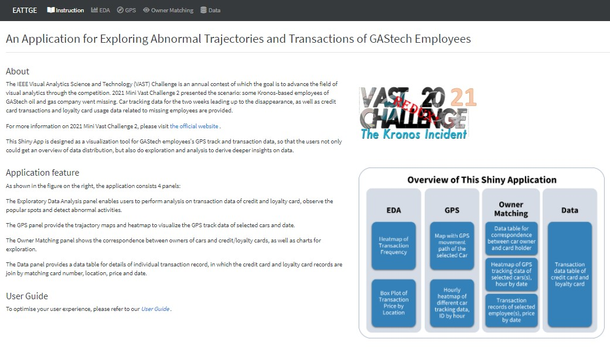
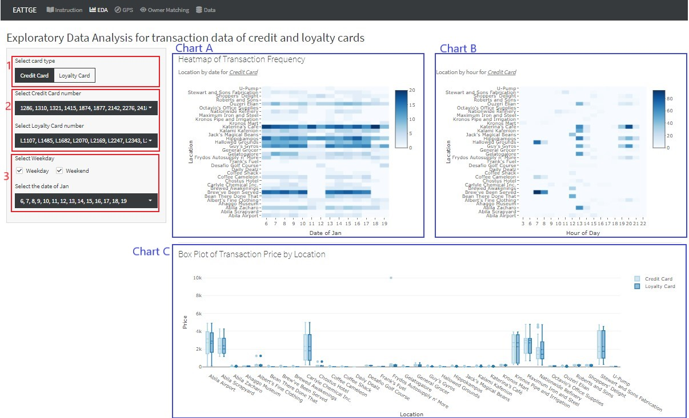
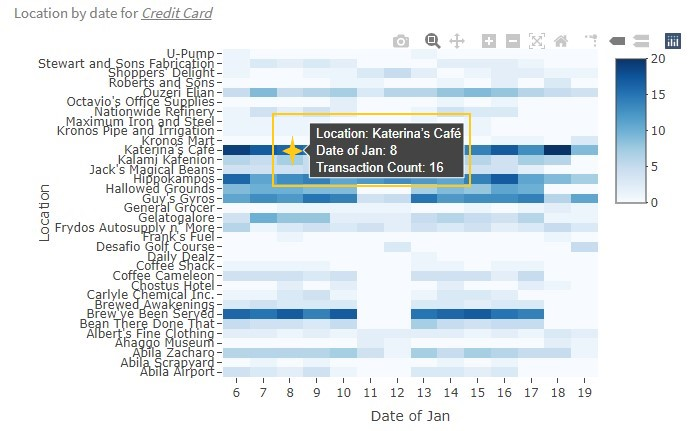
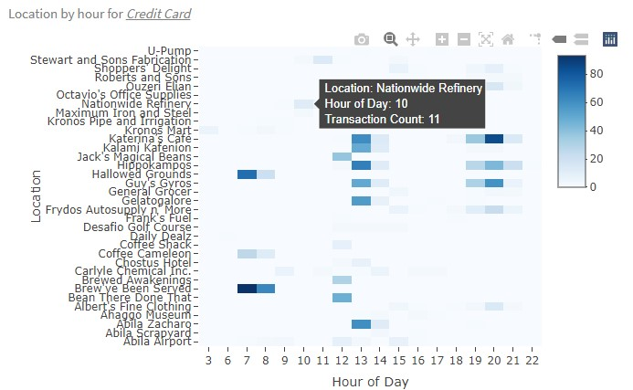
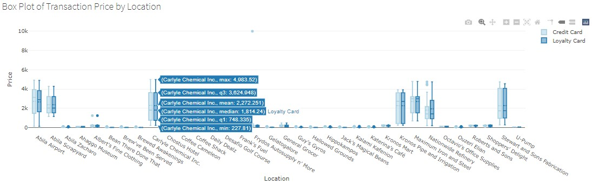
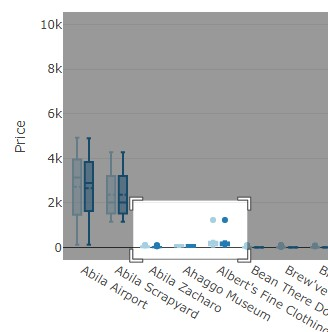

```{r setup, include=FALSE}
knitr::opts_chunk$set(echo = FALSE)
```

**Guidance on how to use the Shiny App for exploring abnormal trajectories and transactions of GAStech employees**

# 1. Landing Page

The landing page of the application provides a brief background, features and skeleton overview for this application.

{width=100%} <br> <p style="text-align:center;"> _Fig.1 Landing page of Shiny App_ </p>

# 2. EDA

Use this tab to do exploratory data analysis on credit card and loyalty card transaction data.

{width=100%} <br> <p style="text-align:center;"> _Fig.2 The panel for EDA_ </p>
[1] Switch the heatmap to show credit card or loyalty card in chart A. <br>
[2] Select one or multiple credit/loyalty card number to transactions of specific cards for chart A, B and C. <br>
[3] Select all weekday/weekend or particular dates to filter transactions in specific days for chart A, B, C

<p style="text-align:center;"> {width=45%} {width=45%} {width=100%}  <br> _Fig.3 Hover over on charts to see the tooltip_ </p>

[4] Hover cursor over plot area to see the location, date/hour and transaction count for heatmap, see the maximum, minimum, mean, median and quartile transaction price for boxplot.

<p style="text-align:center;"> {width=50%} <br> _Fig.4 Zoom in and out on boxplot_ </p>

[5] Drag and drop on plot area to zoom in on the boxplot and see details clearly of boxes. Double-click on plot area to restore the default scale of the plotting.

# 3. GPS


# 4. Owner Matching


# 5. Data


