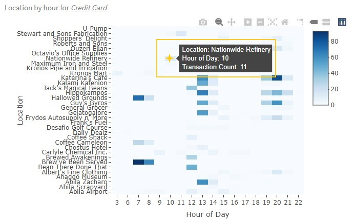
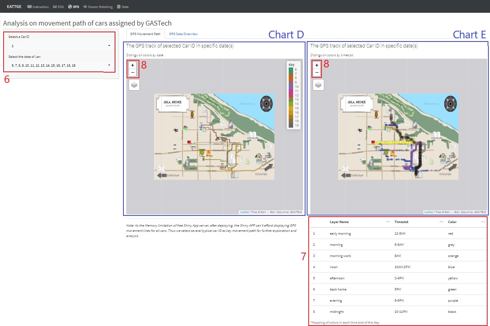
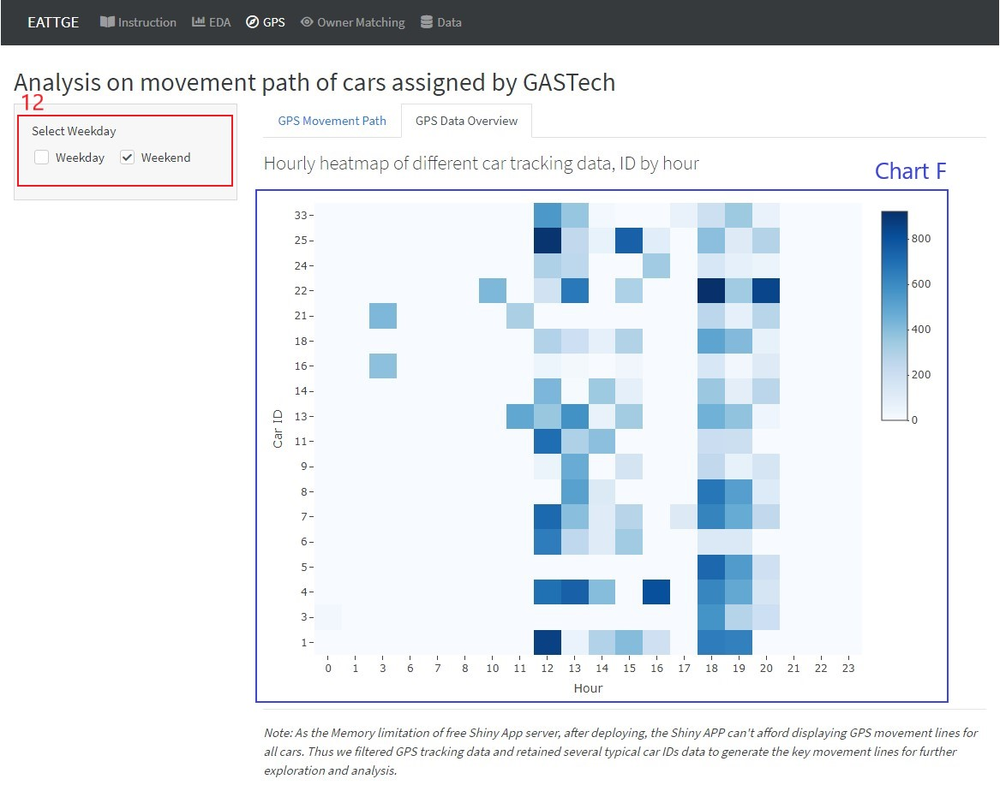

```{r setup, include=FALSE}
knitr::opts_chunk$set(echo = FALSE)
```

**Guidance on how to use the Shiny App for exploring abnormal trajectories and transactions of GAStech employees**

# 1. Landing Page

The landing page of the application provides a brief background, features and skeleton overview for this application.

{width=100%} <br> <p style="text-align:center;"> _Fig.1 Landing page of Shiny App_ </p>

# 2. EDA

This panel is designed to do exploratory data analysis on credit card and loyalty card transaction data.

{width=100%} <br> <p style="text-align:center;"> _Fig.2 The panel for EDA_ </p>
[1] Switch the heatmap to show credit card or loyalty card in chart A. <br>
[2] Select one or multiple credit/loyalty card number to transactions of specific cards for chart A, B and C. <br>
[3] Select all weekday/weekend or particular dates to filter transactions in specific days for chart A, B, C.

<p style="text-align:center;"> {width=45%} {width=45%} {width=100%}  <br> _Fig.3 Hover over on charts to see the tooltip_ </p>

[4] Hover cursor over plot area to see the location, date/hour and transaction count for chart A/chart B, see the maximum, minimum, mean, median and quartile transaction price for chart C.

<p style="text-align:center;"> {width=50%} <br> _Fig.4 Zoom in and out on boxplot_ </p>

[5] Drag and drop on plot area to zoom in on chart C and see details clearly of boxes. Double-click on plot area to restore the default scale of the plotting.

# 3. GPS

This panel is designed to visualize the GPS tracking data. Two sub-tabs constitute this panel.

{width=100%} <br> <p style="text-align:center;"> _Fig.5 The first sub-tab of the panel for GPS_ </p>
In the first sub-tab: <br>
[6] Select particular car ID and date(s) to show GPS movement path for selected car in selected date(s) in chart D and E. <br>
[7] The table shows which timeslot each color represents in chart E, and the layer names of the respective timeslots. <br>
[8] This buttons are used to zoom in our zoom out the map for displaying more details.

<p style="text-align:center;"> {width=60%} <br> _Fig.6 Legend and tooltip of chart D_ </p>

[9] The legend of chart D shows which day each color represents. <br>
[10] Click on the movement line to see the tooltip indicating on which day this action occurred in January.

<p style="text-align:center;"> {width=60%} <br> _Fig.7 The layers of timeslot in chart E_ </p>

[11] Hover the cursor over the layer logo on the upper-left corner to see the layers of Chart E. Check or uncheck particular layers by clicking to see the movement of specific timeslots in selected day. 


_\*Tips: In order to better analysis the movement path, highly recommend to select one car ID to overview all movement lines, then further select one date to observe actions in different timeslots of a day._


{width=100%} <br> <p style="text-align:center;"> _Fig.8 The second sub-tab of the panel for GPS_ </p>
In the second tab: <br>
[12] Check or uncheck weekday or weekend to filter GPS track data in weekday or weekend only for chart F.

<p style="text-align:center;"> {width=50%} <br> _Fig.9 Tooltip in chart F_ </p>

[13] Hover cursor over plot area of chart F to see the car ID, hour and record count of each car in one hour.


# 4. Owner Matching


# 5. Data


